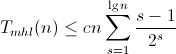

Exercise 3.3: Complexity
========================

This is an attempt to show that the execution time of the fromList function in Exercise 3.3 (see Ex3_3.hs) is O(n).

Let Tm(s) be the execution time of the merge function in LeftistHeap.hs, where s is the size of the larger of the two sets being merged. Similarly, let Tmhl(n) be the execution tims of the mergeHeapList function in Ex3_3.hs, where n is the length of the list being processed.

Calling mergeHeapList on a list of n one-element heaps results in the merge function being called up to n times. The first pass (i.e. the first call to the mergePairs function) involves n/2 calls to merge with heaps of size 1, the second pass consists of n/4 calls to merge heaps of size 2, etc, with lg(n) passes in total. In other words, we have

Since Tm(n) is O(log n), we get, for some constant c,

Simplifying the above:

For Tmhl to be O(n), we need for the sum above to be bounded by a constant. Applying the [ratio test](https://en.wikipedia.org/wiki/Ratio_test) by taking the ratio of two adjacent terms in a series to see if the sum converges as n tends to infinity, we get

As s tends to infinity, the ratio tends to 1/2, so the sum converges. (In fact, [pluging it into Wolfram Alpha](http://www.wolframalpha.com/input/?i=sum+of+%28x-1%29%2F2^x) tells us that the sum converges to the starting value, so starting at s = 1, the sum tends to 1).

In other words,

Where c and k are constants, so Tmhl(n) is O(n). Since fromList only does O(n) preprocessing on a list before passing it on to mergeHeapList, the execution time of fromList is also O(n).

Shoutout: LaTeX to GIF conversion done with [CodeCogs](http://www.codecogs.com/latex/htmlequations.php).

